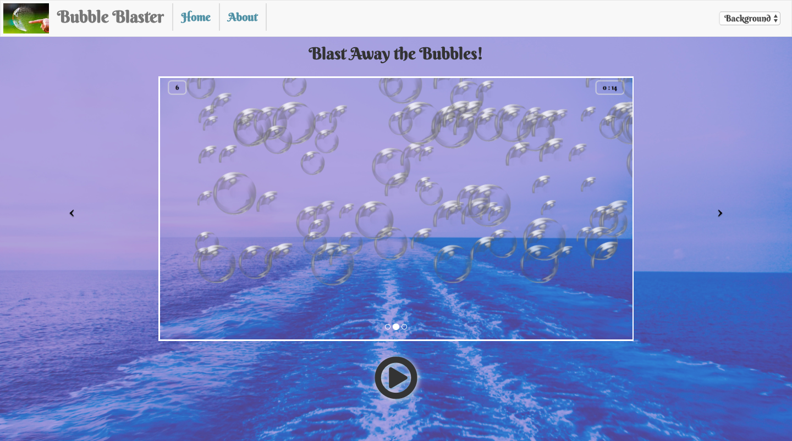
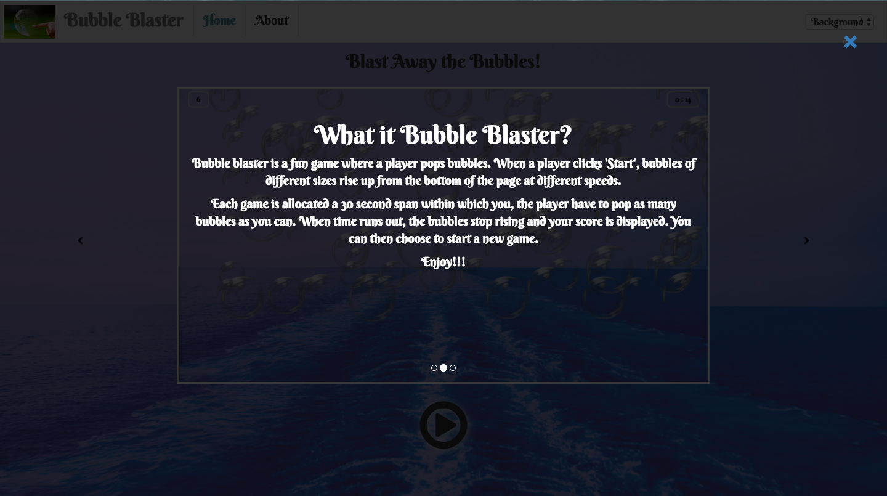

# Bubble Blaster

#### A web application game where a user pops bubbles that appear randomly on the page within a limited time span.

## Created by [John Mutavi](https://github.com/jonnygovish) , [Shadrack Ndolo](https://github.com/ShadrackNdolo), [Mary Ng'ang'a](https://github.com/marynganga) and [Carol Wanjohi](https://github.com/carolwanjohi)

## Description
Bubble Blaster is a game where when a user clicks the play button bubbles are generated randomly across the page. They then have to pop as many bubbles as they can within a limited time span. This is accomplished when the user clicks the bubbles. After the set time is over their score is displayed.

## Specifications
| Behaviour | Input | Output |
| ------------- |:-------------:| -----:|
| Press play to open game console | Press play | Navigate to play console page |
| Start the game | Press start | Bubbles appear on the page |
| Countdown | Starts after pressing start | A timer that displays the amount of time left until game over | 
| Display results | Timer running out / Game over | Score : 30 |
| Refresh the game | Press the resfresh link | Gaming area is reloaded | 

## Demo

This is the landing page for Bubble Blaster

This is the about overlay

This is the play console page

This is the game running

This is the score modal

## Setup/Installation
* Click [Bubble Blaster](https://jonnygovish.github.io/Bubble-Blaster-Game)  
  or  
* Copy https://jonnygovish.github.io/Bubble-Blaster-Game to your browser and load it.

## Known Bugs
* Not compatible with mobile devices
* Some bubbles appear as incomplete
* Score counter is not 100% accurate

## Technologies Used
* HTML
* CSS
* BOOTSTRAP
* JAVASCRIPT
* JQUERY

## Licence
MIT &copy;2017 **[John Mutavi](https://github.com/jonnygovish) , [Shadrack Ndolo](https://github.com/ShadrackNdolo), [Mary Ng'ang'a](https://github.com/marynganga) and [Carol Wanjohi](https://github.com/carolwanjohi)**
